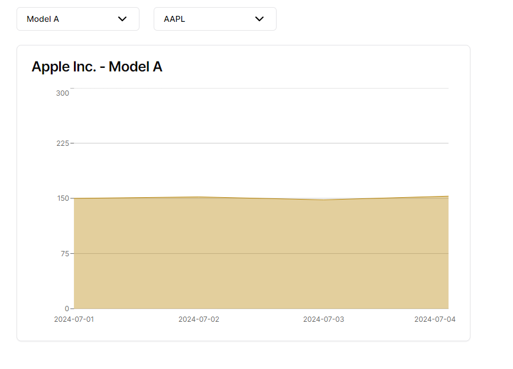

# Process
First I noticed that which stock selected is a state that is going to be shared to multiple components (the chart and the dropdown). What I did was first set up a context provider to be able to pass around state to the different components that need it. 

Second I created a drop down for both the model and the selected stock. Selecting the values would change the state passed by the context. 

Then the chart gets the current stock selected and gets the corresponding data and displays it. 

Main components used:
- components/
  - models-dropdown.tsx 
  - stocks-dropdown.tsx
  - stock-chart.tsx

Noticeable issues:
- The dates on the bottom 

Improvements:
- dates on the bottom should be properly formatted ex. Jul. 1
- UI improvements to graph
